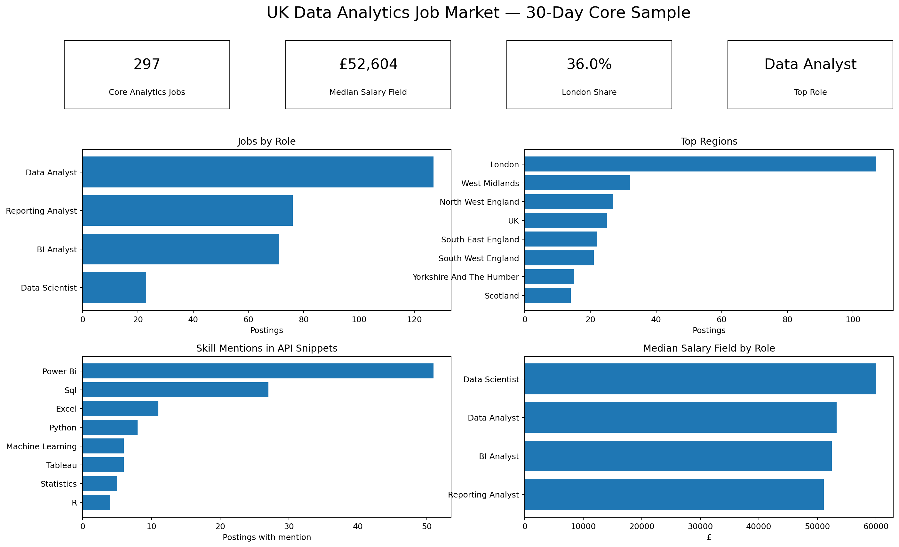
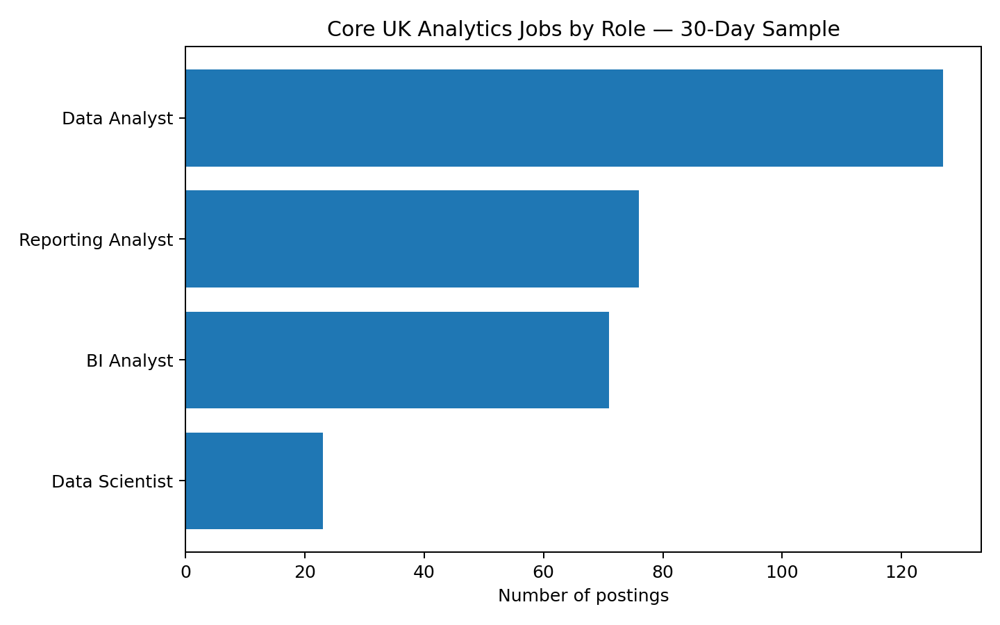
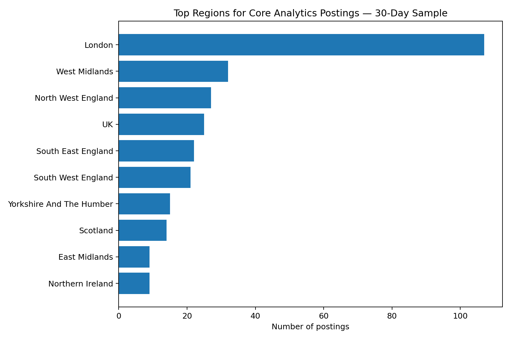
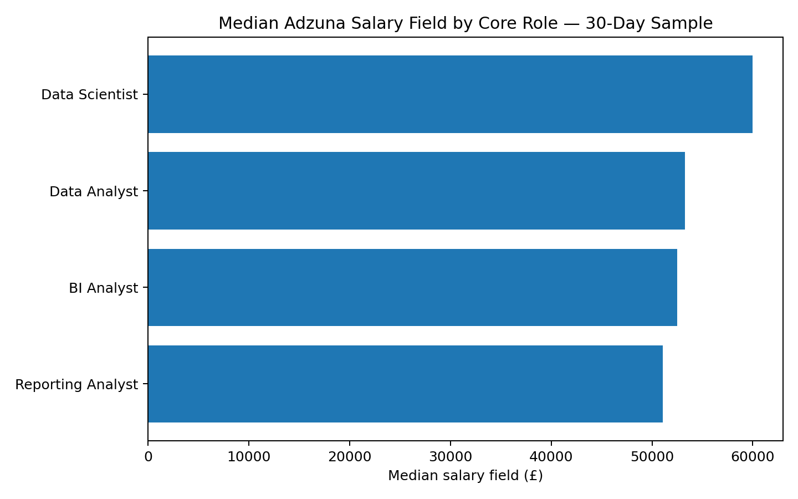
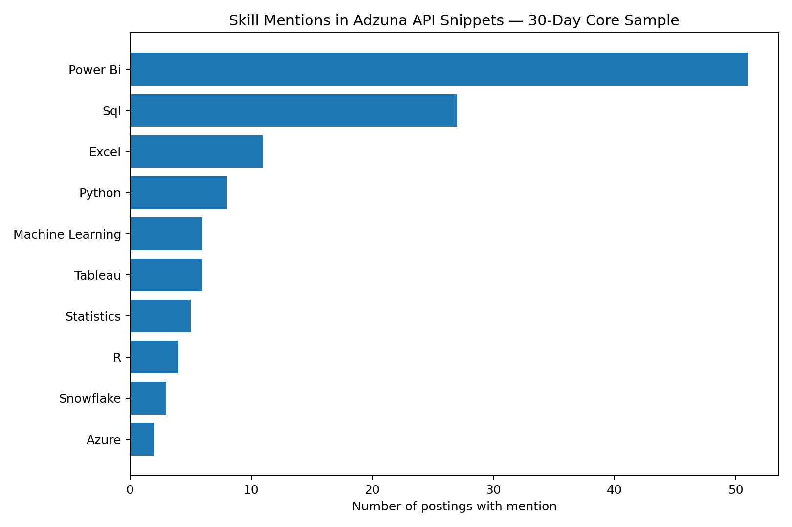

# UK Data Analytics Job Market

**Python | SQL | Pandas | REST API | Power BI | GitHub Actions**

An end-to-end portfolio project analysing the UK data and analytics job market using live Adzuna vacancy data and public UK labour-market sources.



## Project Objective

This project asks:

> **What does the current UK data analytics job market look like in terms of role demand, geography, salary fields, and technical skill mentions?**

The project was designed to demonstrate an MSc-level analytics workflow rather than a single notebook exercise.

## Latest Analysis Snapshot

The API extract contained **798 unique job records**. To make the headline analysis more relevant, I restricted the portfolio sample to postings from the previous 30 days classified as:

- Data Analyst
- BI Analyst
- Reporting Analyst
- Data Scientist

This produced a **297-job core analytics sample**.

## Key Findings

### Role Demand

| Role | Jobs | Share | Median Salary Field |
|---|---:|---:|---:|
| Data Analyst | 127 | 42.8% | £53,288 |
| Reporting Analyst | 76 | 25.6% | £51,095 |
| BI Analyst | 71 | 23.9% | £52,500 |
| Data Scientist | 23 | 7.7% | £60,000 |

**Data Analyst** was the largest role group in the 30-day core sample.



### Geography

London accounted for **107 jobs (36.0%)** of the core analytics sample.

Other high-volume regions are shown below.



### Salary

The median cleaned Adzuna salary field across the core sample was approximately:

## **£52,604**

Among the four core role groups, **Data Scientist** had the highest median salary field in this sample.



### Technology Mentions

The most frequently detected technologies in the Adzuna API description snippets were:

| Skill | Jobs with Mention | Share |
|---|---:|---:|
| Power Bi | 51 | 17.2% |
| Sql | 27 | 9.1% |
| Excel | 11 | 3.7% |
| Python | 8 | 2.7% |
| Tableau | 6 | 2.0% |
| Machine Learning | 6 | 2.0% |
| Statistics | 5 | 1.7% |
| R | 4 | 1.3% |



> **Important:** Adzuna's search API returns shortened description snippets. These percentages therefore represent **skill mentions detected in API snippets**, not the full percentage of employers requiring each skill.

## Data Pipeline

```text
Adzuna API
    |
    v
Raw vacancy collection
    |
    v
Python cleaning + deduplication
    |
    v
Role / seniority classification
    |
    v
Salary preparation
    |
    v
Regex-based skill extraction
    |
    v
SQL + Python analysis
    |
    v
Power BI-ready outputs
    |
    v
GitHub portfolio
```

## Repository Structure

```text
.
├── charts/
├── dashboard/
├── data/
│   ├── raw/
│   └── processed/
├── docs/
├── notebooks/
├── outputs/
├── sql/
├── src/
├── tests/
└── README.md
```

## Analytical Outputs

The project generates reusable files including:

- `core_analytics_jobs_30d.csv`
- `role_summary_30d.csv`
- `region_summary_30d.csv`
- `skill_mentions_30d.csv`
- `skill_by_role_30d.csv`
- `seniority_summary_30d.csv`
- `top_employers_30d.csv`

## Skills Demonstrated

### Python
- REST API requests
- Pandas
- data cleaning
- deduplication
- feature engineering
- regular expressions
- summary analytics
- data visualisation

### SQL
- aggregation
- filtering
- median salary analysis
- regional analysis
- role comparisons
- skill co-occurrence
- employer analysis

### BI / Reporting
- KPI design
- Power BI-ready tables
- dashboard planning
- data storytelling

### Engineering / Reproducibility
- Git/GitHub
- GitHub Actions
- `.gitignore`
- environment variables
- unit testing
- reproducible pipelines
- data documentation

## Methodology

### Role filtering

The full search results contained many broad roles that were returned because they matched search keywords.

For the main portfolio analysis, only these classified roles were used:

```text
Data Analyst
BI Analyst
Reporting Analyst
Data Scientist
```

The analysis was also restricted to postings created within 30 days of extraction.

### Skill extraction

Skill flags were created using regular expressions applied to available title and description-snippet text.

Tracked skills include:

```text
SQL
Python
R
Power BI
Tableau
Excel
AWS
Azure
GCP
Snowflake
Databricks
Spark
dbt
Power Query
DAX
SAS
Alteryx
Statistics
Machine Learning
Git
```

## Limitations

- Adzuna search results are a sample of the online job market, not every UK vacancy.
- Search terms may return roles outside the core analytics market.
- Description text returned by the search API is abbreviated.
- Skill detection is based on keyword/regex matching and does not measure proficiency.
- The current dataset did not preserve Adzuna's `salary_is_predicted` field, so salary values are described as **Adzuna salary fields** rather than automatically as employer-disclosed salaries.
- Job postings are not identical to official vacancy statistics.

## Future Improvements

- preserve `salary_is_predicted` in future API extracts
- automate weekly/monthly data snapshots
- add NLP-based skill extraction
- compare salary by skill combination
- add a database/warehouse layer
- add dbt transformations
- build a live Streamlit dashboard
- compare API vacancy trends with ONS labour-demand data

## Interview Summary

> I built a reproducible UK job-market analytics pipeline using live vacancy data. I used Python for ingestion, cleaning, feature engineering and skill extraction, SQL for analytical questions, and prepared Power BI-ready reporting outputs. I also documented API limitations, added automated testing, and used GitHub Actions so the project behaves like a real analytics workflow rather than a one-off notebook.

## Author

**Sam**  
MSc Data Analytics
